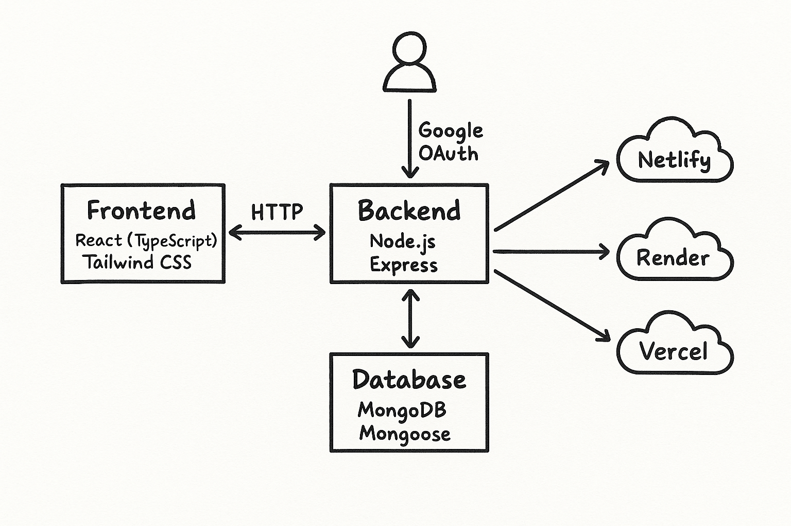

# CodeThrone - Your Coder Army

Welcome to **CodeThrone**, a comprehensive platform designed to enhance coding, collaboration, and learning through interactive contests, discussions, and real-time chat features. This project is built with modern web technologies and follows best practices for scalability, maintainability, and user experience.

---

## Table of Contents
- [Overview](#overview)
- [Features](#features)
- [Project Structure](#project-structure)
- [Technologies Used](#technologies-used)
- [Setup & Installation](#setup--installation)
- [Usage Guide](#usage-guide)
- [Backend Services](#backend-services)
- [Frontend Application](#frontend-application)
- [Deployment](#deployment)
- [Contributing](#contributing)
- [License](#license)

---

## Overview
**CodeThrone** is a full-stack web application that brings together competitive programming, collaborative problem-solving, and social interaction. Users can participate in coding contests, discuss solutions, chat in real-time, and track their progress. The platform is ideal for students, professionals, and coding enthusiasts looking to improve their skills and connect with others.

---

## Features
- **Coding Contests:** Participate in timed contests, solve problems, and view leaderboards.
- **Problem Playground:** Practice problems with a built-in code editor supporting multiple languages.
- **Discussion Forums:** Engage in topic-based discussions, share insights, and ask questions.
- **Real-Time Chat:** Communicate instantly with other users in chat rooms and private messages.
- **User Profiles:** Track achievements, contest history, and personal progress.
- **Announcements:** Stay updated with platform news and contest notifications.
- **Admin Dashboard:** Manage contests, users, and platform content.
- **Redeem System:** Earn and redeem points for achievements and participation.

---

## Project Structure
```
root/
├── backend/         # Node.js Express backend, models, routes, services
├── client/          # Frontend source (React)
├── public/          # Static assets
├── server/          # Server entry point
├── src/             # Main frontend app (TypeScript, React)
│   ├── components/  # Reusable UI components
│   ├── config/      # API configuration
│   ├── contexts/    # React context providers
│   ├── pages/       # Application pages (Home, Contest, Chat, etc.)
│   └── utils/       # Utility functions
├── build.sh         # Build script
├── start.sh         # Start script
├── package.json     # Project dependencies
├── vite.config.ts   # Vite configuration
└── ...              # Other config and documentation files
```

---

## Technologies Used
- **Frontend:** React, TypeScript, Tailwind CSS, Vite
- **Backend:** Node.js, Express, MongoDB
- **Real-Time:** Socket.io
- **Authentication:** Passport.js
- **Code Execution:** Judge0 API
- **Styling:** PostCSS, ESLint

---

## Setup & Installation
1. **Clone the Repository:**
   ```bash
   git clone https://github.com/CodingEnthusiastic/Building-Wonders---2.git
   cd Building-Wonders---2
   ```
2. **Install Dependencies:**
   - Backend:
     ```bash
     cd backend
     npm install
     ```
   - Frontend:
     ```bash
     cd ../src
     npm install
     ```
3. **Environment Variables:**
   - Configure `.env` files in `backend/` and `src/` as needed (see `loadenv.js`).
4. **Run the Application:**
   - Start backend:
     ```bash
     npm start
     ```
   - Start frontend:
     ```bash
     npm run dev
     ```

---

## Usage Guide
- **Contests:** Navigate to the Contest page to join ongoing or upcoming contests. Problems are displayed with a timer and leaderboard.
- **Playground:** Use the Playground for practicing problems and testing code in various languages.
- **Chat:** Access chat rooms for real-time communication. Private messaging is also supported.
- **Profile:** View your achievements, contest history, and redeem points for rewards.
- **Admin:** Admins can manage contests, users, and announcements via the dashboard.
- 

---

## Backend Services
- **Models:** User, Problem, Contest, ChatRoom, Announcement, Redeem, etc.
- **Routes:** RESTful APIs for authentication, contest management, chat, problems, and more.
- **Services:** Judge0 integration for code execution, Passport.js for authentication, and custom business logic.
- **Socket:** Real-time chat and game features using Socket.io.

---

## Frontend Application
- **Pages:** Home, Contest, Problems, Discussion, Chat, Profile, Admin Dashboard, etc.
- **Components:** Code editor, Navbar, Certificate, Rainbow Cursor, ProtectedRoute, and more.
- **Contexts:** AuthContext for authentication, ThemeContext for UI themes.
- **Styling:** Tailwind CSS for rapid UI development and theming.

---

## Deployment
- **Scripts:** Use `build.sh` and `start.sh` for building and starting the application.
- **Configuration:** Vite, ESLint, Tailwind, and PostCSS for optimized builds and code quality.
- **Render:** Deployment configuration via `render.yaml` and `render-deployment.md`.

---

## Contributing
We welcome contributions! Please read the [PROJECT_DOCUMENTATION.md](PROJECT_DOCUMENTATION.md) for guidelines. Open issues, submit pull requests, and help us build a better platform.

---

## License
This project is licensed under the MIT License. See the licensed file for details.

---

## Contact & Support
For questions, suggestions, or support, please open an issue or contact the maintainers via GitHub.

---

Thank you for being a part of Building Wonders!
